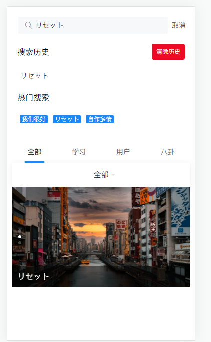
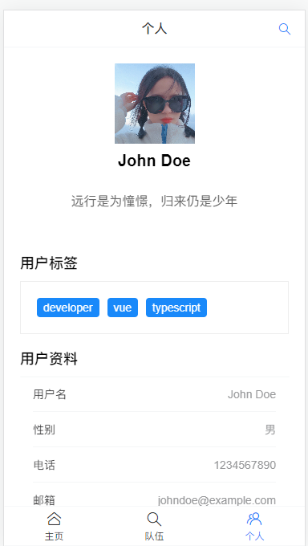

## 目录结构

├── public/                     # 静态资源如 logo、favicon.ico 等
│   ├── favicon.ico
│   └── index.html              # 主页面
├── src/                        # 源代码目录
│   ├── api/                    # API 请求
│   ├── assets/                 # 模块资源
│   ├── components/         # 全局复用组件
│   ├── directives/             # 自定义指令
│   ├── models/                # 自定义ts类型
│   ├── layouts/                # 页面布局
│   ├── mixins/                 # 混入
│   ├── plugins/                # 插件
│   ├── router/                 # 路由
│   ├── store/                  # 全局 vuex store
│   ├── styles/                 # 全局样式
│   ├── utils/                  # 工具函数
│   ├── views/                  # 视图组件，基于路由的组件
│   ├── App.vue                 # 主应用组件
│   ├── main.js                 # 应用入口文件
│   └── ...
├── tests/                      # 测试文件
├── .env                        # 环境变量
├── .gitignore                  # 忽略的文件
├── package.json                # 包描述文件
├── README.md                   # 项目说明文档
└── ...

## 技术栈

vue3

ts

vite

vant4

Pinia

## 初始化

进入项目

执行npm i下载依赖

## 页面设计

### 搜索页面设计

1. **搜索历史**：在搜索框下方显示用户的搜索历史，用户可以快速点击历史记录进行搜索。

2. **热门搜索**：在搜索框下方显示当前的热门搜索词，用户可以快速点击热门搜索词进行搜索。

3. **搜索结果分类**：在搜索结果上方添加分类标签，如“全部”，“视频”，“用户”等，用户可以通过点击这些标签来过滤搜索结果。

4. **搜索结果展示**：在搜索结果中，除了显示视频的缩略图和标题，还可以显示更多的信息，如视频的播放次数，上传时间，上传者等。

   

### 个人主页设计

1. 用户基本信息（头像，用户名，性别等）
2. 用户的社交信息（邮箱，电话等）
3. 用户的内容（如视频，文章，商品等）
4. 用户的活动（如评论，点赞，收藏等）

